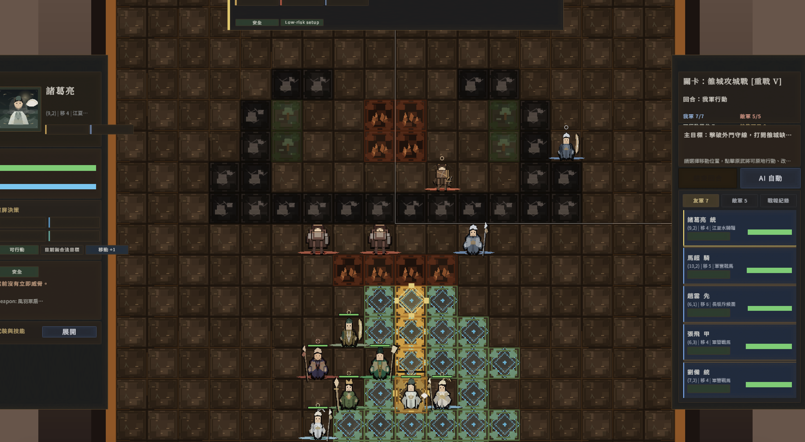
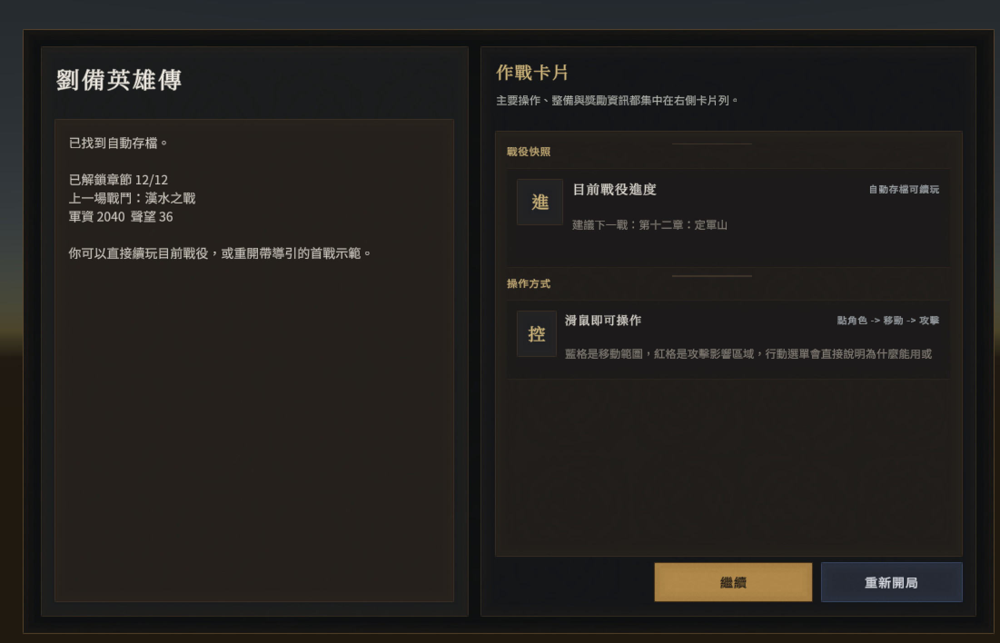
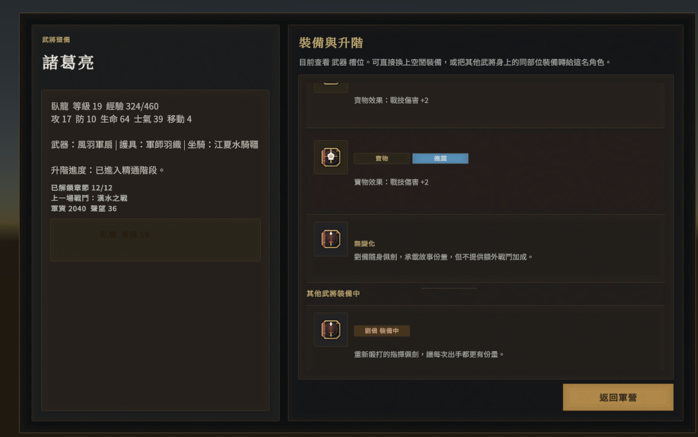

# 方陣戰記（Phalanx Chronicle）

> Demo：點下面預覽圖可直接開啟示範影片  
> [](./Media/phalanx-chronicle_demo.mp4)

這個目錄現在不只是規格包，已經包含一套可在 Unity 中打開的《方陣戰記》SRPG 戰役原型。內容以劉備傳單線戰役為主，從黃巾之亂一路推進到定軍山，並串接軍營整備、寶物獎勵、角色招募、裝備更換與升階流程。

## Demo
- [觀看示範影片](./Media/phalanx-chronicle_demo.mp4)

## 畫面預覽
戰場指揮與行動範圍預覽：


戰役入口與作戰卡片：



武將裝備與升階介面：



## 已完成內容
- 12 章串聯的「劉備英雄傳」戰役，章節從廣宗一路推進到定軍山
- 戰役章節解鎖、已通關章節回放、推薦下一戰與 Replay 難度分級
- 首通獎勵、次要目標寶物、命名武將招募與戰後結算整合
- 軍營主選單、章節選單、戰前簡報、倉庫、軍需官與武將整備介面
- 武將裝備更換、轉裝、卸裝、武器 / 護具 / 坐騎管理
- Lv10 升階分支預覽與轉職、Lv15 精通階段提示
- 戰役存檔 / 讀檔、首啟引導、首戰教學流程與首戰結束後回營
- 10x10 戰場、地形阻擋 / 危險格 / 據點效果、移動路徑與威脅預覽
- 普通攻擊、主動技能、被動技能、狀態效果、寶物與裝備加成
- 玩家回合 / 敵方回合 / 玩家自動模式切換與敵軍 AI 決策
- 戰鬥內 HUD、行動卡、傷害預測、名單側欄、選中單位資訊與結果面板
- 劇情對話、戰場指令、決鬥事件與戰鬥演出節奏控制
- 英文與繁體中文文本表，預設使用繁體中文
- 可用 `dotnet test` 驗證的純 C# 核心規則層與戰役 / UI model / localization 測試

## 主要結構
- `Assets/Scripts/Core/`：戰鬥模擬、AI、技能、地形、戰役進度、招募、裝備、商店與升階規則
- `Assets/Scripts/Battle/`：`GameManager`、`BattleManager`、狀態機、存檔、戰鬥演出與 HUD model builder
- `Assets/Scripts/UI/`：戰鬥 HUD、章節選單、軍營 / 整備 / 倉庫 overlay
- `Assets/Scripts/Presentation/`：角色視覺、地形視覺、UI 主題與執行期 sprite library
- `Assets/Scripts/Localization/`：英文 / 繁中在地化表
- `Assets/Scripts/Editor/`：建立戰鬥場景與視覺資產匯入 / 檢查工具
- `Assets/Resources/`：戰役視覺、角色視覺、地形資產與 unit visual definitions
- `Media/`：README 用展示截圖與 demo 影片
- `Docs/project-docs/`：原始規格、技術設計、里程碑與 GitHub 協作文件
- `Tests/Headless/`：戰鬥模擬、戰役推進、決鬥 / 獎勵、HUD model、localization 覆蓋測試

## 如何啟動
1. 用 Unity 開啟這個目錄。
2. 直接進 Play Mode；若已有戰役存檔，會先看到「繼續 / 重新開局」。
3. 預設會進入劉備傳戰役流程，可從軍營進入章節、整備、商店與倉庫。
4. 如果想建立固定戰場場景，使用 Unity 選單 `Phalanx Chronicle/Create Battle Scene` 產生 `Assets/Scenes/Battle.unity`。

## 驗證
- Headless 規則測試：

```bash
dotnet test Tests/Headless/PhalanxChronicle.Headless.Tests.csproj
```

- 目前測試覆蓋重點包含：
  - 戰役解鎖、招募、首通 / 回放獎勵與存檔正規化
  - 決鬥事件、次要目標獎勵與 Replay 難度調整
  - 戰鬥 forecast / action menu / roster / result model
  - 首戰教學旗標與繁體中文 localization coverage

## CI/CD 與發版
- `.github/workflows/ci.yml` 會在 `push` 到 `main` 與 `pull_request` 時執行 headless 規則測試。
- `.github/workflows/release.yml` 會在推送 `v*` tag，或在 GitHub Actions 手動執行時，建置 macOS 版本並上傳到 GitHub Release。
- Unity 建置前需要先在 repo 的 GitHub Actions secrets 設定以下其中一組：
  - `UNITY_LICENSE`
  - `UNITY_EMAIL`、`UNITY_PASSWORD`、`UNITY_SERIAL`
- 手動發版可到 GitHub Actions 的 `Release` workflow，輸入像 `v0.1.0` 這樣的版本號。
- 也可以直接推 tag 觸發發版：

```bash
git tag v0.1.0
git push origin v0.1.0
```

- 目前產出的 macOS 版本仍是未 notarize 的 app；若要讓一般使用者下載後更順利開啟，建議後續補上 Apple Developer 簽名與 notarization。

## 原始需求與規劃文件
- [01_MVP_規格書.md](./Docs/project-docs/01_MVP_規格書.md)
- [02_技術架構設計.md](./Docs/project-docs/02_技術架構設計.md)
- [03_資料結構與類別設計.md](./Docs/project-docs/03_資料結構與類別設計.md)
- [04_開發里程碑.md](./Docs/project-docs/04_開發里程碑.md)
- [05_Codex_開發提示詞.md](./Docs/project-docs/05_Codex_開發提示詞.md)
- [06_驗收測試清單.md](./Docs/project-docs/06_驗收測試清單.md)
- [07_建議資料夾結構.md](./Docs/project-docs/07_建議資料夾結構.md)
- [08_GitHub_需求管理流程.md](./Docs/project-docs/08_GitHub_需求管理流程.md)
- [09_GitHub_初始_Issue_清單.md](./Docs/project-docs/09_GitHub_初始_Issue_清單.md)
- [10_GitHub_Project_建立說明.md](./Docs/project-docs/10_GitHub_Project_建立說明.md)

## 視覺製作文件
- `Docs/character-visual-production-guide.md`
- `Docs/terrain-visual-production-guide.md`
- `Docs/character-asset-manifest.csv`
- `Docs/templates/character-visual-brief-template.md`
- Unity 選單：`Phalanx Chronicle/Visuals/Prepare Character Art Pipeline`
- 角色美術生成器：`python3 scripts/generate_character_art.py`
- SRPG 戰場像素角色：`python3 scripts/generate_srpg_battle_art.py`
- 地形像素資產生成器：`python3 scripts/generate_terrain_art.py`

## GitHub 協作
- 已補上 `.gitignore`，可避免 Unity 產生檔進版控
- 已補上 `.github/ISSUE_TEMPLATE/` 與 `PULL_REQUEST_TEMPLATE.md`
- 建議將 `Docs/project-docs/04_開發里程碑.md` 的每個 milestone 建成一張 Epic issue，再往下拆成 Feature / Task
- 可用 `scripts/github/bootstrap_initial_github.sh` 建立 labels、milestones 與初始 issues

## License
本專案自有程式碼、文件與原創資產以 MIT License 釋出，詳見 `LICENSE`。

`Assets/TextMesh Pro/` 內附帶的字型、貼圖與相關檔案保留其原始授權，不因本 repo 採用 MIT 而改變；其中 `Assets/TextMesh Pro/Fonts/LiberationSans - OFL.txt` 已附上字型授權文本。
